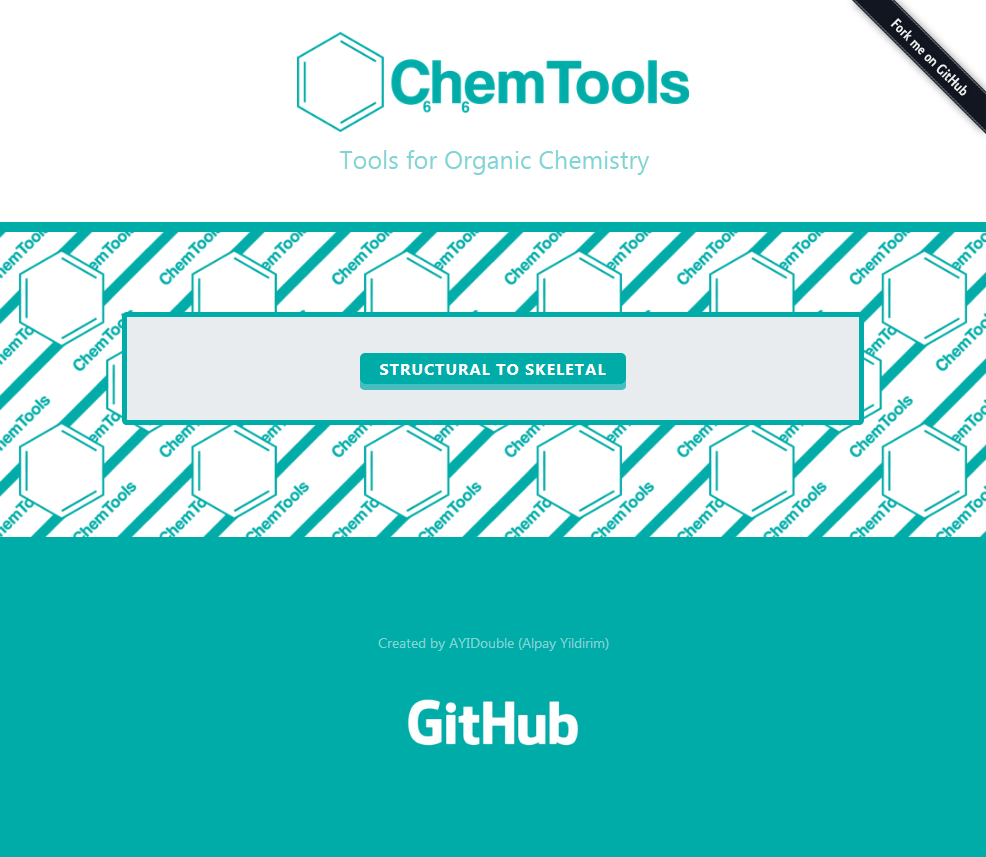

# 🔬 ChemTools ⚗️

**Free** Tools for **Organic Chemistry**

Feel free to use **ChemTools** for teaching **Organic Chemistry** as an example.
If you have Suggestions or find Errors, you're free to contact me on GitHub or submit your changes.
The Reason why I build **ChemTools** was, because there weren't good **Organic Chemistry** Tools in the Web,
that are **completely free** and don't need to be downloaded, because **it's just a Website** that each device can access to.

## TODO : More to come

## As efficient as possible ⚙

The Tools are designed to give responses on every action,
while you're typing, an algorithm already calculates every input you type and displays the result.

## TODO : ChemTools allows you to

- At vero eos et accusam et justo duo dolores et ea rebum.
- Lorem ipsum dolor sit amet, consetetur sadipscing elitr, sed diam
- At vero eos et accusam et justo duo dolores et ea rebum.

## The Future 💡

- [ ] Structural-to-Skeletal, this means that you can type your Structural formula and it will be converted automatically to the Skeletal formula.
- [ ] Chem of the Day, each day a random Chem gets displayed on the front page with his properties. (The random hash is going to be generated from the Dateformat DD/MM/YYYY)
- [ ] Synthesis Routes, while you're typing in a Chem, the algorithm will automatically search synthesis routes for it. (ex. Aspirin
INN: acetylsalicylic acid)
